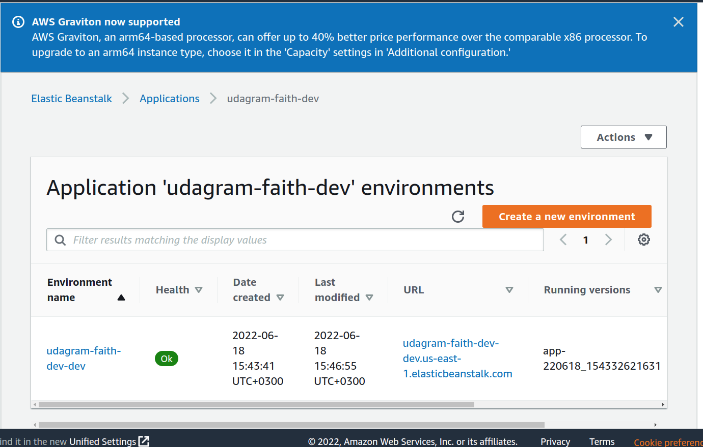

# Udagram
enpoint_url : http://udagram-faith-dev-dev.us-east-1.elasticbeanstalk.com/
## Server
This is the implementatation of an image processing server deployed on AWS

### Set up Node Environment
1. initialize the project `npm i`
2. Run the server with `npm run dev`

## Deploy Server
1. install and initialize `AWSebs` with `eb init`
2. create a new environment that deploys the application `eb create`

The deployed application should look like this in the Elastic Beanstalk 
of your AWS console:

## EBS Snippets

